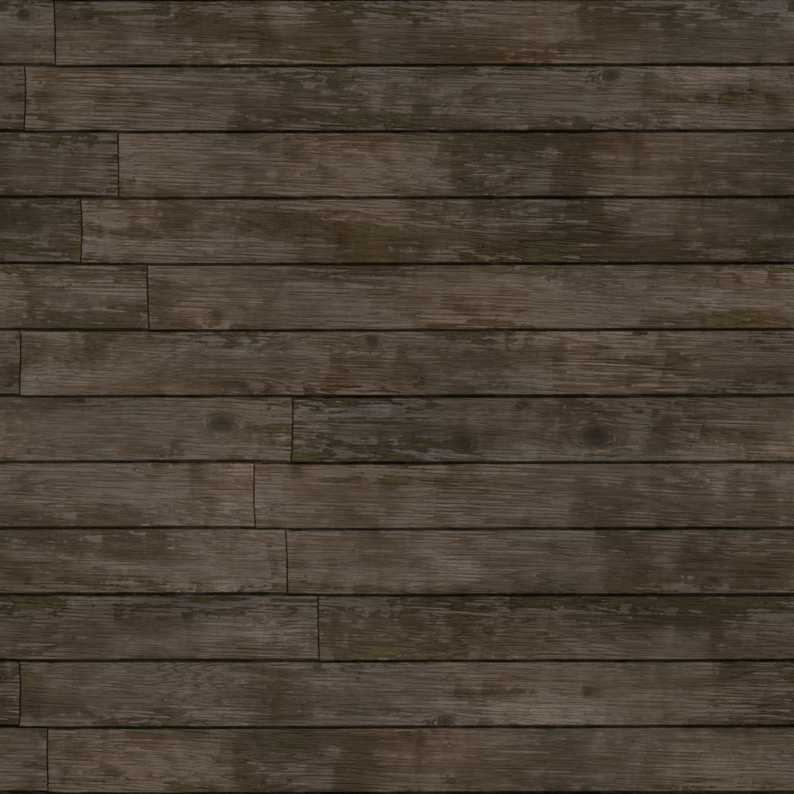
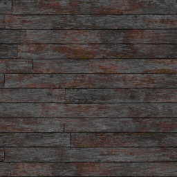
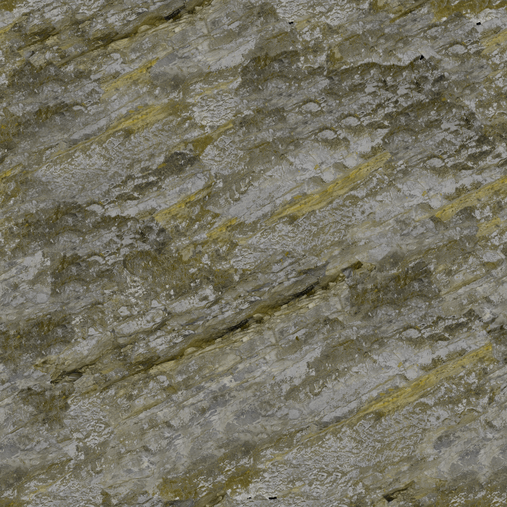
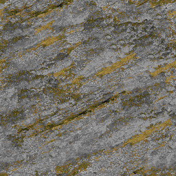

# RetroPixel

> [!WARNING]  
> This project is in an early state.

## Description

RetroPixel is a command line (and hopefully soon GUI) tool for generating pixelised and palettised images.

<p align="center">
  
  
</p>

<p align="center">
  
  
</p>

*"Planks023B" and "Rock051" from AmbientCG pixelised with the Thief: Gold palette.*
## Usage

```
A simple tool for generating pixelised and palettised images

Usage: retro-pixel [OPTIONS] --palette-path <PALETTE_PATH> --input-path <INPUT_PATH>

Options:
  -p, --palette-path <PALETTE_PATH>          
  -i, --input-path <INPUT_PATH>              
  -o, --output-path <OUTPUT_PATH>            
  -s, --pixel-scale <PIXEL_SCALE>            [default: 4]
  -d, --dither                               
  -e, --dither-exponent <DITHER_EXPONENT>    [default: 2]
  -t, --dither-threshold <DITHER_THRESHOLD>  [default: 0.05]
  -b, --batch                                
      --hue <HUE>                            Shift hue [range: 0..=360]
      --saturation <SATURATION>              Adjust saturation [range: -100..=100]
      --brightness <BRIGHTNESS>              Adjust brightness [range: -100..=100]
      --contrast <CONTRAST>                  Adjust contrast [range: -100..=100]
  -h, --help                                 Print help
  -V, --version                              Print version
```

## Credits

RetroPixel takes a lot of inspiration from the following tools and articles:

* [PixaTool by Kronbits](https://kronbits.itch.io/pixatool)
* [Quick and dirty image dithering by Nelarius](https://nelari.us/post/quick_and_dirty_dithering/)
* [Joel Yliluoma's arbitrary-palette positional dithering algorithm by Joel Yliluoma/Bisqwit](https://bisqwit.iki.fi/story/howto/dither/jy/)
* [Faux Pixel Art with Blender, Rust, Fancy Color Spaces and 'Borrowed' Algorithms by David Cosby](https://davjcosby.github.io/all-published/miscellaneous-tech/Faux%20Pixel%20Art%20with%20Blender,%20Rust,%20Fancy%20Color%20Spaces%20and%20'Borrowed'%20Algorithms.html)

## License

RetroPixel is licensed under [MIT](LICENSE-MIT) OR [Apache-2.0](LICENSE-APACHE).